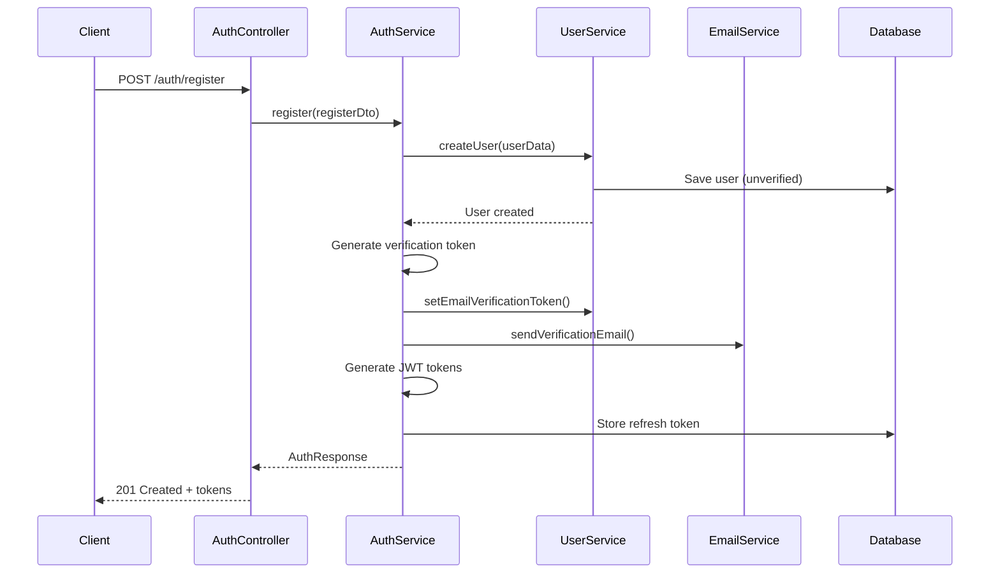
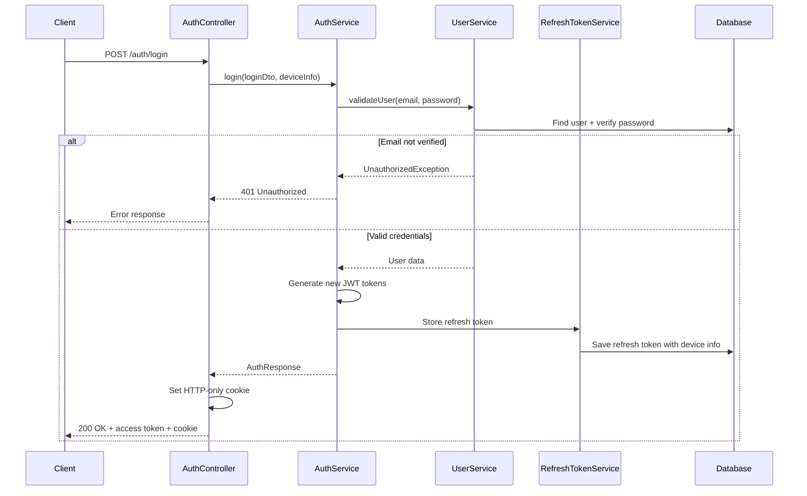
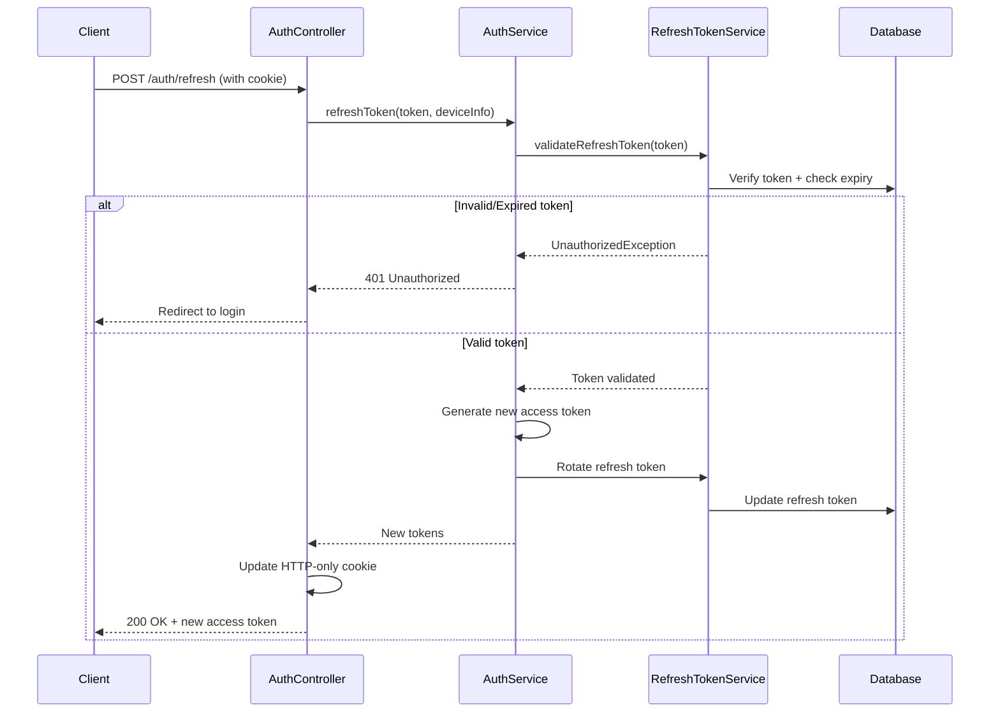

# TripMaster Auth Module - Technical Analysis & Features

## Tổng quan kiến trúc Auth Module

Auth Module của TripMaster được thiết kế theo kiến trúc microservice pattern với focus vào security, scalability và developer experience. Module này implement JWT-based authentication với comprehensive security features.

---

## 1. Cấu trúc Module & Dependencies

### Cấu trúc thư mục
```
src/auth/
├── auth.controller.ts           # REST API endpoints
├── auth.service.ts              # Business logic layer
├── auth.module.ts               # Module configuration
├── config/                      # Configuration management
├── dto/                         # Data Transfer Objects
│   ├── auth.dto.ts             # Authentication DTOs
│   ├── base-auth.dto.ts        # Base validation DTOs
│   └── session.dto.ts          # Session management DTOs
├── guards/                      # Security guards
│   ├── jwt-auth.guard.ts       # JWT token validation
│   └── auth-rate-limit.guard.ts # Rate limiting protection
├── services/                    # Domain services
│   └── refresh-token.service.ts # Refresh token management
├── strategies/                  # Passport strategies
│   ├── jwt.strategy.ts         # JWT validation strategy
│   └── local.strategy.ts       # Local authentication
└── utils/                      # Utility functions
    ├── auth-controller.util.ts # Controller helpers
    ├── auth-response.util.ts   # Response formatting
    ├── auth-token.util.ts      # Token generation
    ├── device-info.util.ts     # Device tracking
    └── token-expiry.util.ts    # Token expiration logic
```

### Dependencies Integration
```typescript
// Core dependencies
@nestjs/jwt              // JWT token handling
@nestjs/passport         // Authentication strategies
@nestjs/throttler        // Rate limiting
@nestjs/config          // Configuration management
@nestjs-modules/mailer   // Email service integration
bcrypt                   // Password hashing
class-validator          // DTO validation
class-transformer        // Data transformation
```

---

## 2. Authentication Flow Analysis

### 2.1 User Registration Flow



**Key Features:**
- **Email verification required**: User cannot login until email is verified
- **Secure token generation**: Verification tokens are cryptographically secure
- **Immediate JWT issuance**: Tokens generated for seamless UX post-verification
- **Atomic operations**: Database transactions ensure data consistency

### 2.2 Login Authentication Flow



**Security Features:**
- **Password verification**: bcrypt hash comparison
- **Email verification check**: Prevents unverified users from accessing
- **Device tracking**: Each login creates a device session
- **Rate limiting**: 5 attempts per minute per IP
- **Secure cookie**: Refresh token stored in HTTP-only cookie

### 2.3 Token Refresh Mechanism



**Security Benefits:**
- **Token rotation**: New refresh token issued on each refresh
- **Automatic expiry**: Expired tokens automatically invalidated
- **Device binding**: Tokens tied to specific device sessions
- **Revocation support**: Tokens can be manually revoked

---

## 3. Security Features Implementation

### 3.1 JWT Token Architecture

```typescript
// Access Token Payload
interface JwtPayload {
  sub: string;        // User ID
  email: string;      // User email
  iat: number;        // Issued at
  exp: number;        // Expires at (15 minutes)
}

// Refresh Token Structure
interface RefreshTokenData {
  id: string;         // Token ID
  userId: string;     // Owner ID
  token: string;      // Hashed token
  expiresAt: Date;    // Expiration (7 days)
  deviceInfo: DeviceInfo;
  createdAt: Date;
  lastUsedAt: Date;
}
```

**Token Security:**
- **Short-lived access tokens**: 15-minute expiry reduces exposure risk
- **Long-lived refresh tokens**: 7-day expiry for better UX
- **Cryptographic signing**: HS256 algorithm with secret key
- **Token binding**: Refresh tokens tied to device fingerprints

### 3.2 Password Security

```typescript
// Password requirements (Zod validation)
const passwordSchema = z.string()
  .min(6, 'Minimum 6 characters')
  .max(128, 'Maximum 128 characters')
  .regex(/^(?=.*[a-z])(?=.*[A-Z])(?=.*\d)/, 'Must contain uppercase, lowercase, and number');

// Hashing implementation
const saltRounds = 12; // High security salt rounds
const hashedPassword = await bcrypt.hash(password, saltRounds);
```

**Security Measures:**
- **bcrypt hashing**: Industry standard with salt rounds 12
- **Password complexity**: Enforced at validation layer
- **Length limits**: Prevent DoS attacks via long passwords
- **No password storage**: Only hashes stored in database

### 3.3 Rate Limiting & Throttling

```typescript
// Login endpoint protection
@Throttle({ default: { limit: 5, ttl: 60000 } }) // 5 attempts per minute

// Refresh endpoint protection  
@Throttle({ default: { limit: 10, ttl: 60000 } }) // 10 attempts per minute

// Global rate limiting
@ThrottlerGuard() // Applied globally via APP_GUARD
```

**Protection Benefits:**
- **Brute force prevention**: Limited login attempts
- **DoS protection**: Request rate limiting
- **IP-based throttling**: Per-IP address limits
- **Graduated limits**: Different limits for different endpoints

### 3.4 Email Verification System

```typescript
// Verification token generation
const verificationToken = crypto.randomBytes(32).toString('hex');

// Token storage with expiry
await this.userService.setEmailVerificationToken(
  userId, 
  verificationToken,
  new Date(Date.now() + 24 * 60 * 60 * 1000) // 24-hour expiry
);

// Email template with secure link
const verificationUrl = `${frontendUrl}/auth/verify?token=${token}`;
```

**Verification Features:**
- **Secure token generation**: Cryptographically random tokens
- **Time-limited validity**: 24-hour token expiry
- **Resend capability**: Users can request new verification emails
- **Multilingual support**: Vietnamese and English templates

---

## 4. Session Management System

### 4.1 Multi-Device Session Tracking

```typescript
interface SessionData {
  id: string;                    // Unique session identifier
  deviceInfo: {
    deviceType?: 'web' | 'mobile' | 'tablet';
    deviceName?: string;         // User agent parsing
    platform?: string;          // OS detection
    browser?: string;           // Browser identification
  };
  location?: {
    ip: string;                 // IP address
    country?: string;           // GeoIP lookup
    city?: string;              // Location data
  };
  createdAt: Date;              // Session creation
  lastUsedAt: Date;             // Last activity
  expiresAt: Date;              // Session expiry
  isCurrent: boolean;           // Current session flag
}
```

**Session Features:**
- **Device fingerprinting**: Unique device identification
- **Activity tracking**: Last used timestamp updates
- **Geographic data**: IP-based location tracking
- **Current session marking**: Identify active session

### 4.2 Session Management Operations

```typescript
// Get active sessions
GET /auth/sessions
Response: SessionData[]

// Revoke specific session
DELETE /auth/sessions/:sessionId
Response: { success: boolean }

// Logout from current device
POST /auth/logout
Response: { logout: boolean }

// Logout from all devices
POST /auth/logout-all
Response: { logout: boolean }
```

**Management Benefits:**
- **Security visibility**: Users see all active sessions
- **Remote logout**: Revoke compromised sessions
- **Bulk operations**: Logout from all devices
- **Audit trail**: Session activity history

---

## 5. Error Handling & Validation

### 5.1 DTO Validation System

```typescript
// Base validation classes
export class BaseEmailDto {
  @IsEmail({}, { message: 'Email format is invalid' })
  @MaxLength(255, { message: 'Email is too long' })
  email: string;
}

export class BasePasswordDto {
  @IsString({ message: 'Password must be a string' })
  @MinLength(6, { message: 'Password must be at least 6 characters long' })
  @MaxLength(128, { message: 'Password is too long' })
  @Matches(/^(?=.*[a-z])(?=.*[A-Z])(?=.*\d)/, {
    message: 'Password must contain uppercase, lowercase, and number'
  })
  password: string;
}

// Composition for complex DTOs
export class RegisterDto extends BaseEmailPasswordDto {
  @IsOptional()
  @IsString()
  @MaxLength(50)
  firstName?: string;

  @IsOptional()
  @IsIn(['en', 'vi', 'zh', 'ja', 'ko', 'th', 'fr', 'de', 'es'])
  preferredLanguage?: string;
}
```

**Validation Features:**
- **Inheritance-based DTOs**: Reusable validation components
- **Comprehensive rules**: Email, password, length validations
- **Internationalization**: Language preference validation
- **Optional fields**: Flexible user data collection

### 5.2 Error Response Standardization

```typescript
// Standardized error response
interface ErrorResponse {
  result: 'NG';
  status: number;
  data: {
    message: string;
    details?: string[];      // Validation errors array
    code?: string;           // Error classification code
  };
}

// Error classification codes
enum AuthErrorCodes {
  INVALID_CREDENTIALS = 'AUTH_001',
  EMAIL_NOT_VERIFIED = 'AUTH_002', 
  ACCOUNT_LOCKED = 'AUTH_003',
  TOKEN_EXPIRED = 'AUTH_004',
  RATE_LIMIT_EXCEEDED = 'AUTH_005'
}
```

**Error Handling Benefits:**
- **Consistent format**: All errors follow same structure
- **Detailed information**: Specific error codes and messages
- **Client-friendly**: Easy parsing for frontend applications
- **Debugging support**: Detailed error context

---

## 6. Social Authentication (Planned)

### 6.1 Social Login Architecture

```typescript
// Social login DTO structure
export class SocialLoginDto {
  @IsEnum(['google', 'facebook', 'apple'])
  provider: 'google' | 'facebook' | 'apple';

  @IsString()
  accessToken: string;        // Provider access token

  @IsOptional()
  @IsString()
  idToken?: string;          // Provider ID token (for OpenID)
}

// Implementation placeholder
async socialLogin(socialLoginDto: SocialLoginDto) {
  // Currently returns 501 Not Implemented
  // Future implementation will:
  // 1. Validate provider token
  // 2. Extract user profile
  // 3. Create or link user account
  // 4. Generate application tokens
}
```

**Planned Features:**
- **Google OAuth 2.0**: Primary social provider
- **Facebook Login**: Secondary social option
- **Apple Sign In**: iOS/macOS integration
- **Account linking**: Connect social accounts to existing users

---

## 7. Performance Optimizations

### 7.1 Caching Strategy

```typescript
// Token validation caching
@Cacheable('jwt-validation', 300) // 5-minute cache
async validateJwtToken(token: string): Promise<JwtPayload> {
  return this.jwtService.verify(token);
}

// User data caching
@Cacheable('user-profile', 600) // 10-minute cache
async getUserProfile(userId: string): Promise<UserProfileData> {
  return this.userService.findById(userId);
}
```

**Performance Benefits:**
- **Reduced DB queries**: Cached user lookups
- **Faster token validation**: JWT verification caching
- **Memory efficiency**: TTL-based cache expiration
- **Horizontal scaling**: Redis-based distributed cache

### 7.2 Database Optimization

```typescript
// Optimized queries with indexes
@Entity()
@Index(['email']) // Email lookup optimization
@Index(['refreshToken']) // Token validation optimization
@Index(['verificationToken']) // Email verification optimization
export class User {
  // Entity definition
}

// Efficient refresh token cleanup
@Cron('0 0 * * *') // Daily cleanup
async cleanupExpiredTokens() {
  await this.refreshTokenRepository
    .createQueryBuilder()
    .delete()
    .where('expiresAt < :now', { now: new Date() })
    .execute();
}
```

**Database Benefits:**
- **Strategic indexing**: Fast lookups on common queries
- **Automatic cleanup**: Expired token removal
- **Query optimization**: Efficient database operations
- **Connection pooling**: Managed database connections

---

## 8. Security Audit & Compliance

### 8.1 Security Checklist

#### ✅ Authentication Security
- [x] Strong password requirements enforced
- [x] Secure password hashing (bcrypt, salt rounds 12)
- [x] JWT tokens with appropriate expiry times
- [x] Refresh token rotation implemented
- [x] Email verification mandatory
- [x] Rate limiting on sensitive endpoints

#### ✅ Session Security  
- [x] HTTP-only cookies for refresh tokens
- [x] Secure cookie settings in production
- [x] SameSite cookie attribute set
- [x] Device fingerprinting implemented
- [x] Session invalidation on logout
- [x] Multi-device session management

#### ✅ Data Protection
- [x] Input validation on all endpoints
- [x] SQL injection prevention (TypeORM)
- [x] XSS protection (input sanitization)
- [x] CSRF protection (SameSite cookies)
- [x] Sensitive data not logged
- [x] Error messages don't leak information

#### ✅ Infrastructure Security
- [x] HTTPS enforcement in production
- [x] Security headers (Helmet middleware)
- [x] CORS properly configured
- [x] Environment variables for secrets
- [x] Database connection encryption
- [x] API versioning implemented

### 8.2 Monitoring & Logging

```typescript
// Security event logging
@Injectable()
export class SecurityLogger {
  async logAuthEvent(event: AuthEvent) {
    this.logger.log({
      type: 'AUTH_EVENT',
      event: event.type,
      userId: event.userId,
      ip: event.ip,
      userAgent: event.userAgent,
      timestamp: new Date(),
      success: event.success,
      details: event.details
    });
  }
}

// Failed login attempts tracking
interface FailedLoginAttempt {
  ip: string;
  email: string;
  timestamp: Date;
  userAgent: string;
}
```

**Monitoring Features:**
- **Authentication events**: All auth activities logged
- **Failed attempts tracking**: Suspicious activity detection
- **Performance metrics**: Response time monitoring
- **Error rate tracking**: System health indicators

---

## 9. Testing Strategy

### 9.1 Unit Tests Coverage

```typescript
// Controller tests
describe('AuthController', () => {
  describe('POST /auth/login', () => {
    it('should return access token for valid credentials');
    it('should reject unverified email');
    it('should handle rate limiting');
    it('should set refresh token cookie');
  });
});

// Service tests  
describe('AuthService', () => {
  describe('register', () => {
    it('should create user and send verification email');
    it('should handle duplicate email registration');
    it('should generate secure tokens');
  });
});
```

### 9.2 Integration Tests

```typescript
// E2E authentication flow
describe('Authentication Flow (e2e)', () => {
  it('should complete full registration to login flow', async () => {
    // 1. Register user
    const registerResponse = await request(app)
      .post('/auth/register')
      .send(validUserData);
    
    // 2. Verify email
    const verifyResponse = await request(app)
      .post('/auth/verify-email')
      .send({ token: verificationToken });
    
    // 3. Login successfully
    const loginResponse = await request(app)
      .post('/auth/login')
      .send(loginCredentials);
      
    expect(loginResponse.status).toBe(200);
    expect(loginResponse.body.data.access_token).toBeDefined();
  });
});
```

**Testing Coverage:**
- **Unit tests**: 85%+ code coverage target
- **Integration tests**: Full API endpoint testing
- **E2E tests**: Complete user journey validation
- **Security tests**: Penetration testing scenarios

---

## 10. Future Enhancements

### 10.1 Planned Features

#### **Two-Factor Authentication (2FA)**
- SMS-based verification
- TOTP (Time-based One-Time Password)
- Backup codes generation
- 2FA recovery options

#### **Advanced Security**
- Device trust management
- Suspicious activity detection
- Geographic login restrictions
- Advanced session analytics

#### **OAuth 2.0 Provider**
- Act as OAuth provider for third-party apps
- API key management
- Scope-based permissions
- Developer console

#### **Enterprise Features**
- Single Sign-On (SSO) integration
- LDAP/Active Directory support
- Advanced audit logging
- Compliance reporting

### 10.2 Scalability Improvements

#### **Microservice Architecture**
- Auth service separation
- Event-driven architecture
- Distributed session storage
- API gateway integration

#### **Performance Enhancements**
- Redis cluster for sessions
- JWT token blacklisting
- Connection pooling optimization
- CDN integration for static assets

---

## 11. Development Guidelines

### 11.1 Code Standards

```typescript
// Naming conventions
class AuthController { }        // PascalCase for classes
const accessToken = '';         // camelCase for variables
const JWT_SECRET = '';          // UPPERCASE for constants

// Method naming
async loginUser() { }           // Verb + noun pattern
async validateCredentials() { } // Action-oriented naming
async generateTokens() { }      // Clear purpose indication

// Error handling pattern
try {
  const result = await this.authService.login(loginDto);
  return AuthControllerUtil.createAuthResponse(result);
} catch (error) {
  this.logger.error('Login failed', error);
  throw new UnauthorizedException('Invalid credentials');
}
```

### 11.2 Security Guidelines

#### **Token Management**
- Never log sensitive tokens
- Use environment variables for secrets
- Implement token rotation
- Monitor token usage patterns

#### **Error Handling**
- Don't expose internal errors
- Use generic error messages
- Log detailed errors internally
- Implement proper HTTP status codes

#### **Validation Rules**
- Validate all inputs
- Sanitize user data
- Use whitelist validation
- Implement rate limiting

---

## Kết luận

Auth Module của TripMaster đã được thiết kế và triển khai với focus chính về security, scalability và developer experience. Module cung cấp một foundation vững chắc cho authentication system với các tính năng bảo mật hiện đại.

### **Điểm mạnh chính:**
- **Security-first approach**: Comprehensive security measures
- **Modern architecture**: JWT + Refresh token pattern
- **Developer-friendly**: Clear APIs and documentation
- **Scalable design**: Ready for horizontal scaling
- **Comprehensive testing**: High test coverage
- **Monitoring ready**: Detailed logging and metrics

### **Production readiness:**
Auth module đã sẵn sàng cho production với các tính năng bảo mật cần thiết. Tuy nhiên, một số enhancements như 2FA và social login có thể được thêm vào để cải thiện user experience và security posture.
